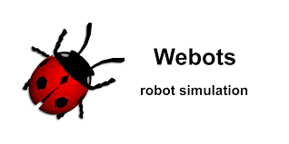

# Aeronav-Practice-Arena
This repository consists of the Practice Arena, for the event  Aeronav'22 being conducted by the Aeromodelling Club, IIT-BHU, Varanasi.

## Event Detail
In the autonomous event we are using Webots simulation.

To visit Webots offical site [click here](https://cyberbotics.com/)

## Installation instructions
###   Webots installation
- Download Webots installation file from the links given below:
  - [Windows](https://github.com/cyberbotics/webots/releases/download/R2022a/webots-R2022a_setup.exe)
  - [macOS](https://github.com/cyberbotics/webots/releases/download/R2022a/webots-R2022a.dmg)
  - [linux (Ubuntu 20.04)](https://github.com/cyberbotics/webots/releases/download/R2022a/webots_2022a_amd64.deb)
  
  (For other versions of operating system visit Webots official site.)

### Python requirement
-  Teams are supposed to use default python version in their OS.
-  Modules and Libraries which they want to use should be installed on their default python.

### World setup

Just clone this git repo and extract the task.zip file.

There will be a world file (.wbt) in this zip file . Teams have to open this world file in Webots and work on it.

>NOTE:- For any doubts regarding any of the above instruction refer [this link](https://cyberbotics.com/doc/guide/index)

## Task for the event

## Drone Specifications:
- We are using `Dji Mavic 2 pro`, which have a downward facing camera to take images.

- We have provided basic code with some function and a basic but not perfect control system from drone . Teams could either use these or use their own code. (The provided code is basically for your understanding about how to code in controller).
- To know about the specification of drone refer this [link](https://www.cyberbotics.com/doc/guide/mavic-2-pro?version=develop#mavic2pro-field-summary)
